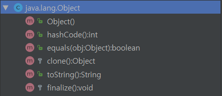
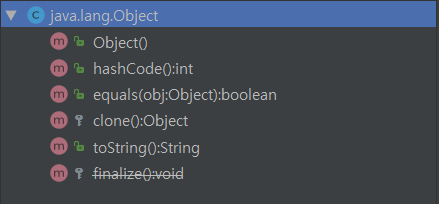
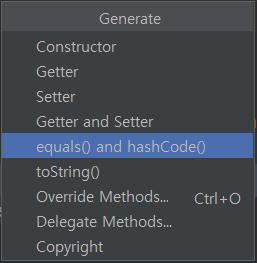

## 3장. 모든 객체의 공통 메서드

> 모든객체는 Object.class를 상속한다. 따라서 각 객체는 Object의 메서드를 잘 재정의해야 한다.

&nbsp;

**java8**



&nbsp;

**java11**




&nbsp;

### 1. equals

```java
    @Override
    public boolean equals(Object o) {
        //...
    }
```

- equals를 재정의하지 않으면?
    + **오직 자기 자신과만 같음** (User@4554617c == User@4554617c)
    + 물리적으로 동일함
- 재정의 해야 할 경우는 언제인가?
    + **논리적 동치성**
        * 물리적으론 다르지만 논리적으로는 같은 경우
            - (상위 클래스에서 재정의했다면 하위 클래스는 생략 가능)
        * ex) user의 이메일이 같을 경우 같은 user로 취급해야 할 경우

**꼭 필요한 경우(논리적 동치성)가 아니라면 equals를 재정의 하지 말 것.**

&nbsp;

#### equals 규약

**(equals를 재정의해야 한다면 다음 5가지 규약을 꼭 지킬 것)**

- not null
    + nyll이 아닌 모든 참조값 x에 대해
    + x.equals(null)은 false
- 반사성
    + null이 아닌 모든 참조값 x에 대해 
    + x.equals(x)는 true
- 대칭성
    + null이 아닌 모든 참조값 x,y에 대해 
    + x.equals(y)가 true면 
    + y.equals(x)도 true
- 추이성
    + null이 아닌 모든 참조값 x,y,z에 대해
    + x.equals(y)가 true이고 y.equals(z)가 true면 
    + x.equals(z)도 true
- 일관성
    + null이 아닌 모든 참조값 x,y에 대해
    + x.equals(y)는 항상 true / false

&nbsp;
&nbsp;

### 2. hashCode

```java
    @Override
    public int hashCode() {
        //...
    }
```

**equals를 재정의할 경우에는 hashCode도 재정의해야 한다.**

```java
@AllArgs
class User {
    int id;
    String name;

    public User(int id, String name) {
        this.id = id;
        this.name = name;
    }

    // equals 재정의 (동치 : name)
    @Override
    public boolean equals(Object o) {
        if (this == o) return true;
        if (o == null || getClass() != o.getClass()) return false;
        User user = (User) o;
        return Objects.equals(name, user.name);
    }
}

public class Main {

    public static void main(String[] args) {
        Set<User> set = new HashSet<>();

        User user1 = new User(1, "준오");
        User user2 = new User(2, "준오");

        set.add(user1);

        System.out.println(set.contains(user2));    
    }
}
```

user1와 user2는 모두 나 자신이다.

왜냐면 equals 재정의로 name이 같기 때문.

따라서 `set.contains(user2)` 은 **true* 가 되야 하지만 **false**를 출력한다.

**hashCode**가 다르기 때문이다.

&nbsp;

**equals를 재정의할 때는 hashCode도 재정의해야 한다.**

(IntelliJ에서 equals와 hashCode를 함께 Generate 하도록 해줌.)



&nbsp;
&nbsp;

### 3. toString

toString은 항상 재정의하라.

- toString 을 재정의하지 않으면?
    + 클래스이름@해쉬코드 (ex. User@4554617c)
    + 클래스에 대해 알기 어려움
- toString 장점
    + 해당 객체에 대해 자세히 알 수 있음
    + 디버깅이 쉽다
- toString 단점
    + 유연성 떨어짐
        * 릴리즈 이후에 포맷을 바꾼다면 기존의 toString에 의존한 코드는 에러 가능성

&nbsp;
&nbsp;

### 4. clone

clone : 해당 클래스의 필드들을 복사한 객체를 반환

```java
public class Hello implements Cloneable{

    private String message;

    @Override
    protected Hello clone() throws CloneNotSupportedException {
        return (Hello) super.clone();
    }
}

---------------------------------

    Hello hello = new Hello();

    Hello hello1 = hello;
    Hello hello2 = hello.clone();

    System.out.println(hello); // Hello@7b69c6ba
    System.out.println(hello1);// Hello@7b69c6ba
    System.out.println(hello2);// Hello@46daef40

```

TODO :: HashTable에서의 Clone

클론은 **복사생성자**, **복사팩터리** 사용을 추천 **(배열 제외)**

복사 생성자 : 단순히 자신과 같은 클래스의 인스턴스를 인수로 받는 생성자

&nbsp;
&nbsp;

### 5. Comparable

Object의 메서드는 아님

Comparable을 구현하면 인스턴스를 sorting할 수 있음.

순서가 명확한 값 클래스라면 Comparable 구현을 고려


#### Case1. Node에서 Comparable 구현
```java
class Node implements Comparable<Node> {
    private int next;
    private int value;

    //...

    @Override
    public int compareTo(Node o) {
        // TODO Auto-generated method stub
        return value - o.value;
    }
}

---------------------------------------------

Queue<Node> q = new PriorityQueue<>();

```

&nbsp;

#### Case2. Comparator 생성
```java
class Node{
    private int next;
    private int value;

    //...
}

---------------------------------------------

// 1. Basic
Queue<Node> q = new PriorityQueue<>( new Comparator<Node>() {
    @Override
        public int compare(Node o1, Node o2) {
            return o1.getValue() - o2.getValue();
        }
});

// 2. Lambda (Java8 이상)
Queue<Node> q2 = new PriorityQueue<>((o1, o2) -> o1.getValue() - o2.getValue());

// 3. comparingInt (Java8 이상)
Queue<Node> q2 = new PriorityQueue<>(Comparator.comparingInt(Node::getValue));
```
